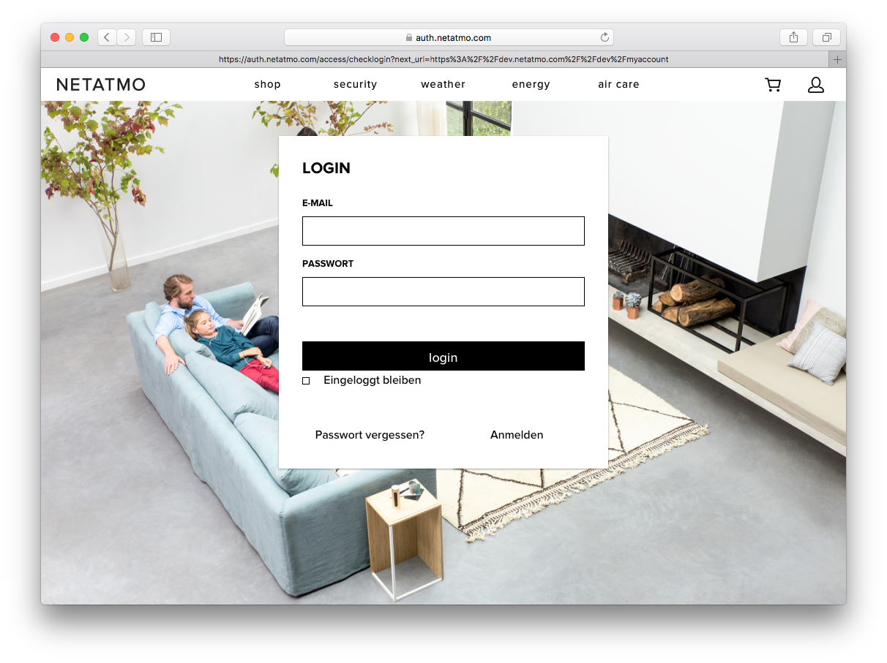
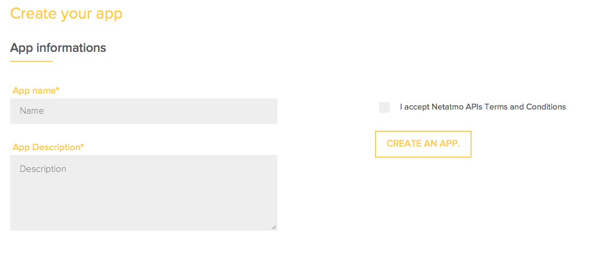
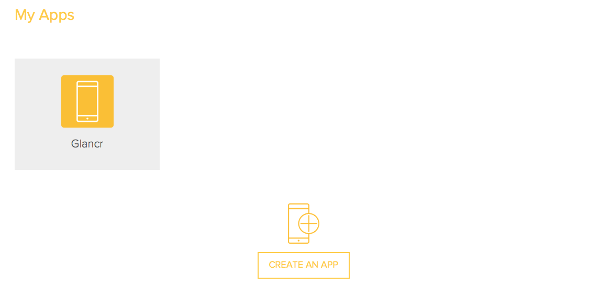
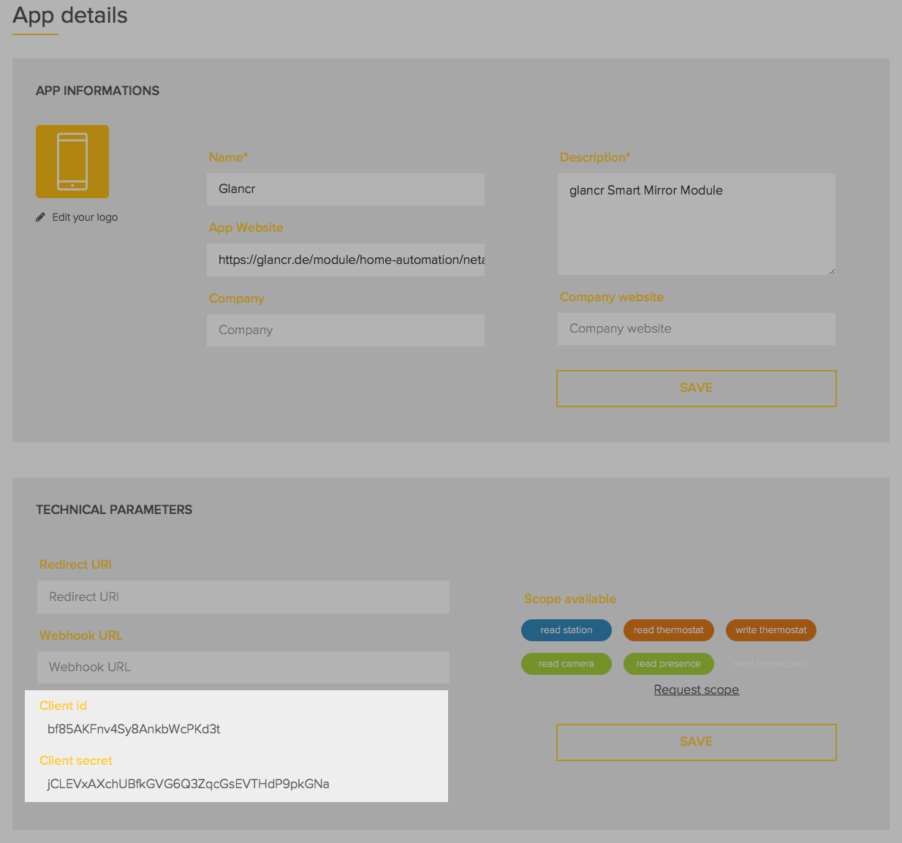
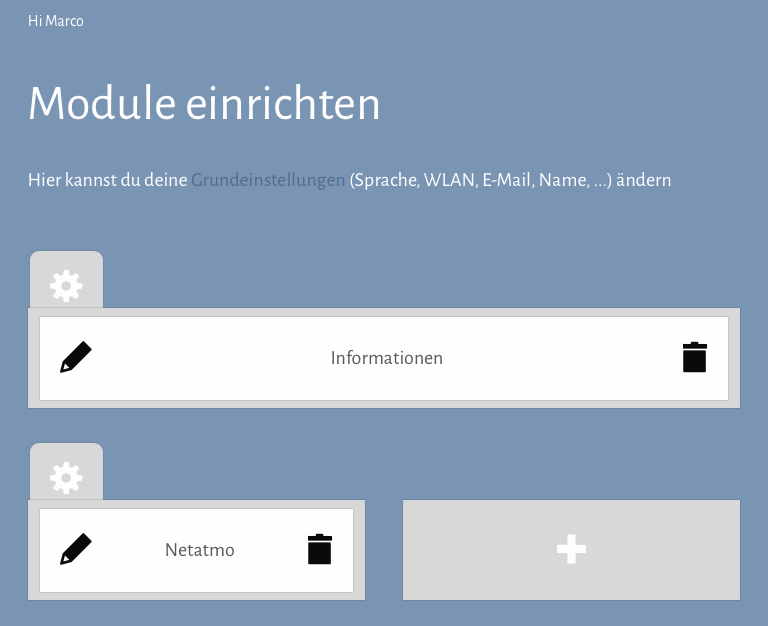
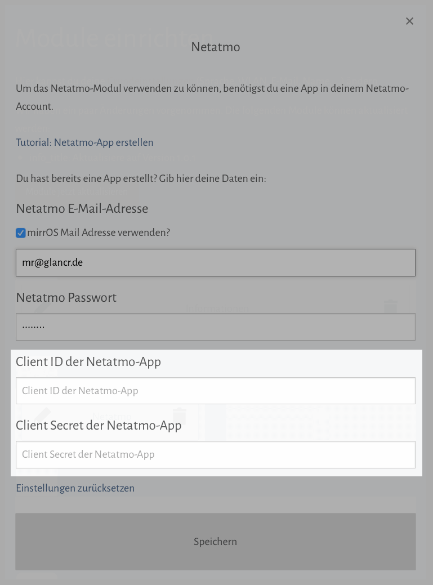
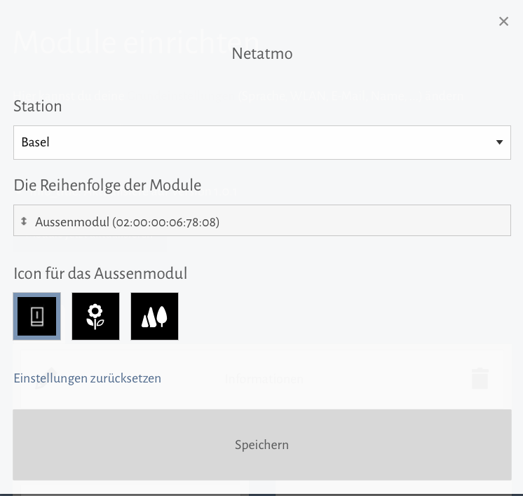
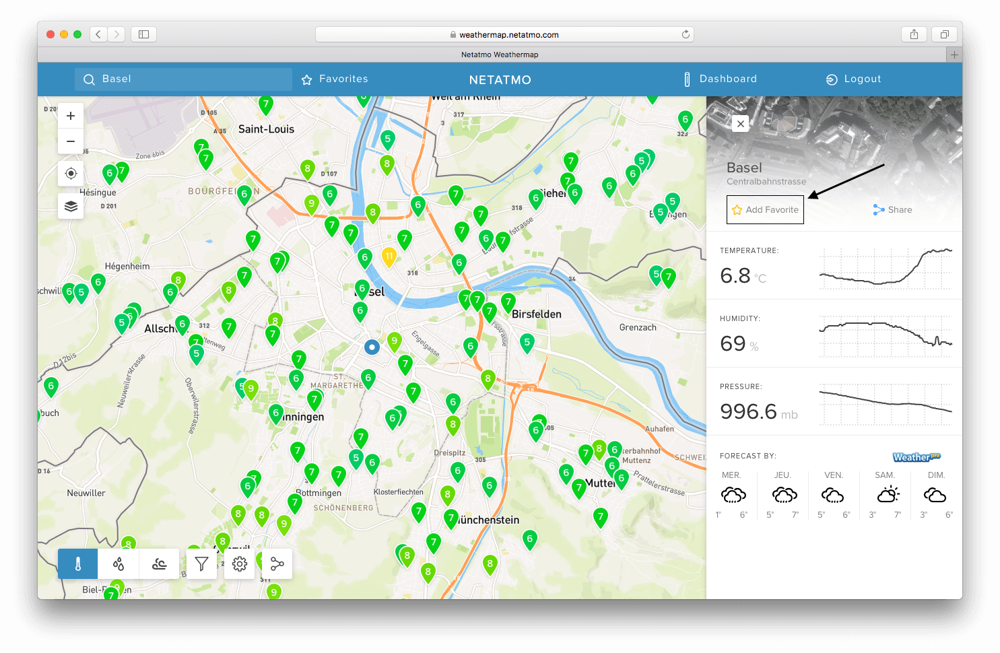
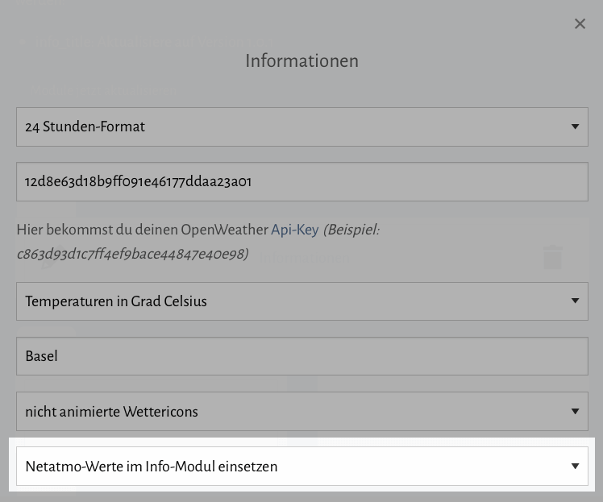

# Netatmo Modul einrichten

Damit das Netatmo-Modul funktioniert, werden zwei Schlüssel (Client ID und Client Secret) benötigt, welche ihr bei Netatmo bekommen könnt.

Dazu muss eine Netatmo-App erstellt werden, welches mit der folgenden Anleitung erklärt wird.

## Download und weitere Informationen

Auf der Modulseite könnt ihr das Netatmo-Modul herunterladen oder weitere Informationen über das Modul finden:

[Netatmo Modulseite](https://glancr.de/module/home-automation/netatmo/)

## Vorausetzungen

Folgende Voraussetzungen müsst ihr erfüllen um das Netatmo-Modul verwenden zu können:

* ein Netatmo-Account

## Schritt für Schritt Anleitung:

### Schritt 1: Mit Account bei Netatmo einloggen
Auf der folgenden [Seite](https://auth.netatmo.com/access/checklogin?next_url=https://dev.netatmo.com/dev/createanapp) könnt ihr ein Netatmo-App erstellen, indem ihr euch mit eurem Netatmo-Account einloggt.

Habt ihr noch kein Account, so müsst ihr euch [hier](https://auth.netatmo.com/de-DE/access/signup?next_url=https%3A%2F%2Fdev.netatmo.com%2Fdev%2Fcreateanapp) einen erstellen.

### Schritt 2: Netatmo-App erstellen

Einmal eingeloggt könnt ihr oben in der Leiste auf den Button [`CREATE YOUR APP`](https://dev.netatmo.com/dev/createanapp) klicken.

Nun erscheint folgendes Formular:

Gebt einen Namen sowie eine Beschreibung an, akzeptiert die API-AGBs und klickt auf den Button `CREATE AN APP`. 

### Schritt 3: Benötigte Schlüssel finden

Nachdem ihr das App erstellt habt, bekommt ihr folgende [Übersicht](https://dev.netatmo.com/dev/myaccount):

Klickt auf das App und es öffnet sich folgendes Fenster:

Unter dem Abschnitt `Technical Parameters` könnt ihr die zwei benötigen Schlüssel `Client ID` und die `Client Secret` wegkopieren, welche dann im Schritt 4 benötigt werden.

### Schritt 4: Schlüssel im Netatmo-Modul einsetzen

Die beiden Schlüssel müssen nun in den Netatmo-Modul Einstellungen eingefügt werden. 

Klickt dazu auf den Stift neben dem Neatmo-Modul. Nun öffnen sich die Einstellungen des Netatmo-Moduls und ihr könnt eure Schlüssel eingeben.

Nun muss euere Netatmo-Account E-Mail Adresse und euer Passwort in die Felder eingegeben werden, sowie die beiden eben generierten Schlüssel in die dafür gesehenen Felder eingefüllt werden. Nun klickt ihr auf Button `Speichern` und das ganze sollte eingerichtet sein.

### Schritt 5: Netatmo-Modul konfigurieren

Nun ist das Netatmo-Modul eingerichtet. Ihr könnt nun eure gewünschte Station auswählen, die Reihenfolge der Module bestimmen und die Icons der einzelnen Module festlegen.

### (Optional) Schritt 6: Netatmo-Stationen von der Netatmo-Weathermap verwenden

Habt ihr keine eigene Netatmo-Station? Kein Problem, ihr könnt auf eine öffentliche Station in eurer Umgebung zugreifen.

Öffnet dazu die [Netatmo-Weathermap](https://weathermap.netatmo.com) und sucht euch eine Station in der Nähe eures Wohnort.

Habt ihr eine gefunden, so klickt ihr diese an und fügt sie als Favorit hinzu:

Es kann sein, dass ihr euch für diesen Schritt mit eurem Netatmo-Account einloggen müsst.

Alle von euch ausgewählen Favoriten tauchen in den Einstellungen des Netatmo-Moduls im Dropdown auf und ihr könnt euch dann eure gewünschte Station auswählen und auf dem Spiegel anzeigen lassen.

### (Optional) Schritt 7: Netatmo Wetterdaten im Info-Modul anzeigen

> WICHTIG: Dieser Schritt klappt nur, wenn ihr das Netatmo-Modul vorher vollständig konfiguriert habt!

Von der Netatmo-Station bekommen wir ziemlich genau Messungen und da wir diese auch andersweitig verwenden können, gibt es im Info-Modul die Option Netatmo-Werte zu verwenden.

Dazu musst du nur in die Einstellungen des Info-Moduls im untersten Dropdown die Option `Netatmo-Werte im Info-Modul einsetzen` auswählen.

Hierfür muss das Netatmo-Modul nicht eingebunden sein, das Info-Modul funktioniert unabhänig davon.

